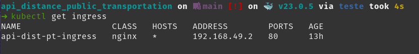

<div align="center">

# API Distance of Public Transportation in São Paulo-BR :bus:
[](https://github.com/BrunoMesquitaa/api_distance_public_transportation/actions/workflows/pytest.yml)
</div>

---

<div align="center">

### **Portuguese version**: <a href="https://github.com/BrunoMesquitaa/api_distance_public_transportation/blob/main/README.md">README.md</a>

</div>

---
## About the API:
> #### The main objective of this REST API is to calculate the distance between a specific point (latitude, longitude) and the nearest public transportation.
>
> Using as basis: 
>
>> Framework FastAPI:
>>> Documentation: https://fastapi.tiangolo.com
>>>
>>> Source code: https://github.com/tiangolo/fastapi
>>
>> GeoPandas:
>>> Documentation: https://geopandas.org/en/stable/
>>>
>>> Source code: https://github.com/geopandas/geopandas
>
> Data:
>
>> Shapefiles: https://geosampa.prefeitura.sp.gov.br/PaginasPublicas/_SBC.aspx
---

## Running the Project:
> ### Local :3rd_place_medal: :
>
> I recommend using a virtualenv.
>
> Installation of packages:
>```console
> poetry install
> ```
> or
>```console
> pip install --no-cache-dir --upgrade -r requirements.txt
> ```
>
> Run:
> ```console
> uvicorn api_distance_public_transportation.main:app --reload
> ```
> 
> Documentation :point_down:
>> http://127.0.0.1:8000/docs
>>
>> http://127.0.0.1:8000/redoc
> ---
> ### Docker :2nd_place_medal: :
>
> Build e Run:
> ```console
> docker build -t {name_docker} .
> docker run -p 8080:8080 {name_docker}
> ```
> Documentation :point_down:
>> http://127.0.0.1:8080/docs
>>
>> http://127.0.0.1:8080/redoc
> ---
> ### K8s :1st_place_medal: :
> I used Minikube so it may be necessary to adapt depending on the case.
>
> Some interesting configurations if you are going to use Minikube:
> ```console
> minikube start
> minikube addons enable ingress
> alias kubectl="minikube kubectl --"
> ```
> Creating our resources on K8s:
> ```console
> kubectl apply -f k8s/kube_deployment.yaml
> ```
> Getting information from our ingress:
> ```console
> kubectl get ingress
> ```
> 
> Using the ADDRESS IP we can access the application.
> 
>
> Documentation :point_down:
>> http://192.168.49.2/docs
>>
>> http://192.168.49.2/redoc
>
> Note that we used an image on DockerHub :point_right: [bmesquitaa](https://hub.docker.com/repository/docker/bmesquitaa/api_distance_public_transportation/general)
---

## Exemplo:
> ### Request body
> ```console
> {
>    "lat": -23.563949,
>    "lon": -46.6568110
> }
> ```
> ### Responses
> ```console
> {
>    "estacao_metro_km": 0.45,
>    "estacao_trem_km": 3.31,
>    "ponto_onibus_km": 0.26,
>    "terminal_onibus_km": 2.35
> }
> ```