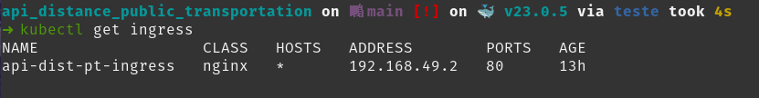

# API Distância do Transporte público em São Paulo-BR :bus:
[](https://github.com/BrunoMesquitaa/api_distance_public_transportation/actions/workflows/pytest.yml)

---

### **English version**: <a href="https://github.com/BrunoMesquitaa/api_distance_public_transportation/blob/main/README-eng.md">README.md</a>

---
## Sobre a API:
> #### O principal objetivo dessa API REST é calcular a distância entre um ponto específico (latitude, longitude) e o transporte público mais próximo.
>
> Usando como base: 
>
>> Framework FastAPI:
>>> Documentação: https://fastapi.tiangolo.com
>>>
>>> Código Fonte: https://github.com/tiangolo/fastapi
>>
>> GeoPandas:
>>> Documentação: https://geopandas.org/en/stable/
>>>
>>> Código Fonte: https://github.com/geopandas/geopandas
>
> Dados:
>
>> </p>Shapefiles: https://geosampa.prefeitura.sp.gov.br/PaginasPublicas/_SBC.aspx</p>
---

## Rodando o Projeto:
> ### Local :3rd_place_medal: :
>
> Recomendo utilizar um virtualenv.
>
> Instalação dos pacotes:
>```console
> poetry install
> ```
> ou
>```console
> pip install --no-cache-dir --upgrade -r requirements.txt
> ```
>
> Run:
> ```console
> uvicorn api_distance_public_transportation.main:app --reload
> ```
> 
> Documentação :point_down:
>> http://127.0.0.1:8000/docs
>>
>> http://127.0.0.1:8000/redoc
> ---
> ### Docker :2nd_place_medal: :
>
> Build e Run:
> ```console
> docker build -t {name_docker} .
> docker run -p 8080:8080 {name_docker}
> ```
> Documentação :point_down:
>> http://127.0.0.1:8080/docs
>>
>> http://127.0.0.1:8080/redoc
> ---
> ### K8s :1st_place_medal: :
> Eu usei o Minikube então pode ser necessário adaptar dependendo do caso.
>
> Algumas configurações interessantes se for usar Minikube:
> ```console
> minikube start
> minikube addons enable ingress
> alias kubectl="minikube kubectl --"
> ```
> Criando nossos recursos no K8s:
> ```console
> kubectl apply -f k8s/kube_deployment.yaml
> ```
> Pegando informações do nosso ingress:
> ```console
> kubectl get ingress
> ```
> 
> Utilizando a IP do ADDRESS podemos acessar a aplicação.
> 
>
> Documentação :point_down:
>> http://192.168.49.2/docs
>>
>> http://192.168.49.2/redoc
>
> Observação usamos uma imagem no DockerHub :point_right: [bmesquitaa](https://hub.docker.com/repository/docker/bmesquitaa/api_distance_public_transportation/general)
---

## Exemplo:
> ### Request body
> ```console
> {
>    "lat": -23.563949,
>    "lon": -46.6568110
> }
> ```
> ### Responses
> ```console
> {
>    "estacao_metro_km": 0.45,
>    "estacao_trem_km": 3.31,
>    "ponto_onibus_km": 0.26,
>    "terminal_onibus_km": 2.35
> }
> ```
